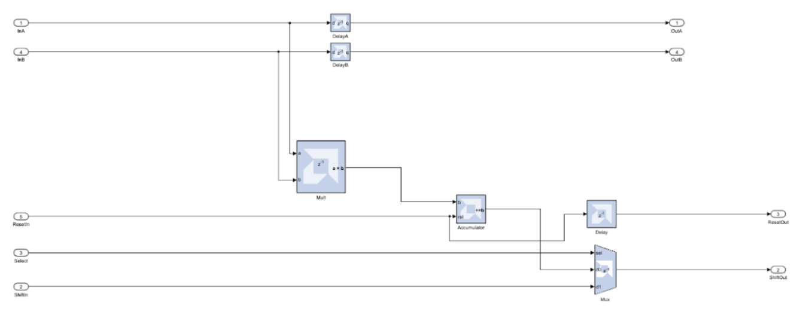
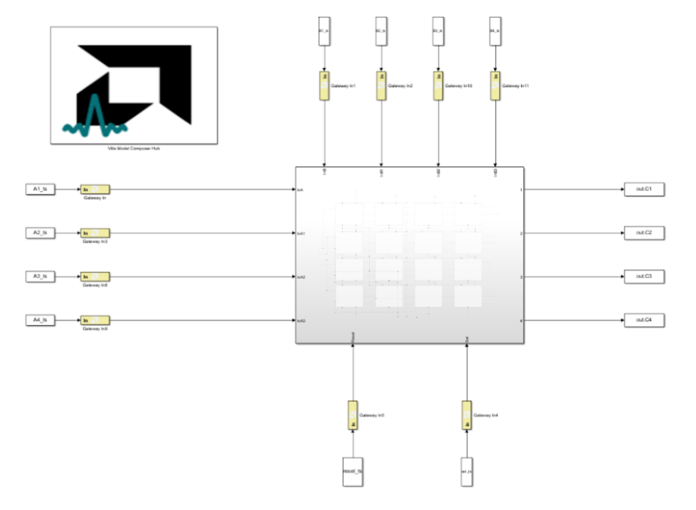
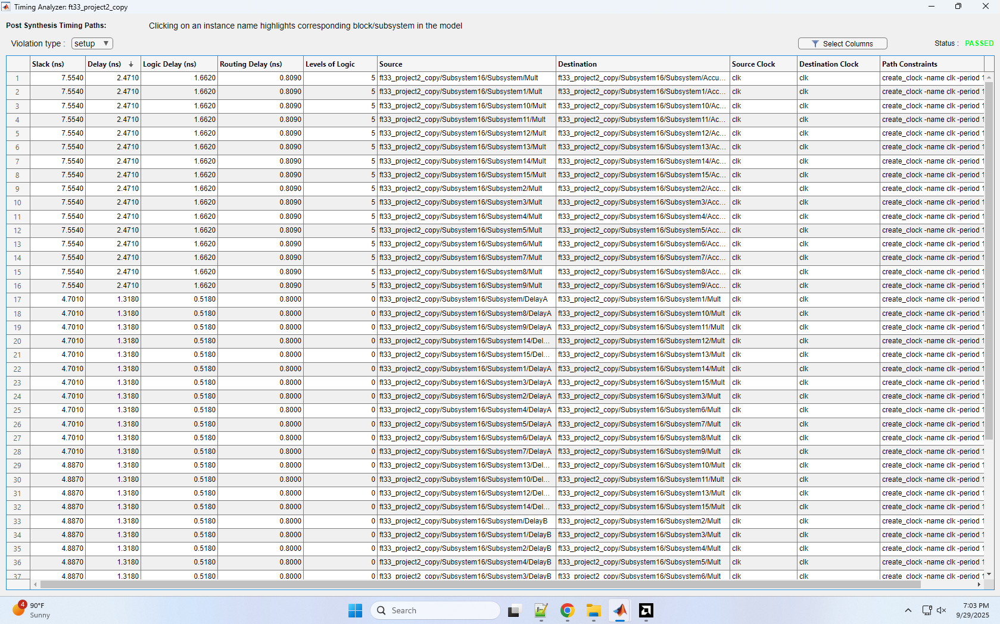
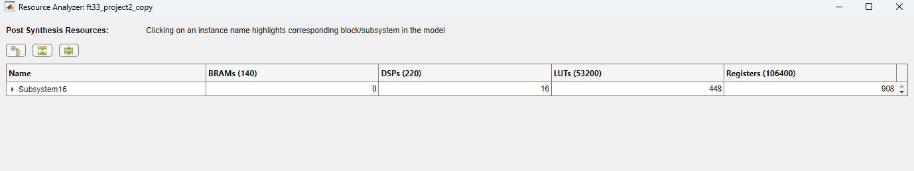

# Systolic Array for 4x4 Matrix Multiplication in Vitis Model Composer

This project is a hardware accelerator for 4x4 matrix multiplication designed using **Vitis Model Composer**. It implements a systolic array architecture to maximize parallelism for loading, computing, and unloading data. The design operates on 16-bit two's complement integer data.

---

## Architecture

The design consists of a 4x4 array of 16 **Processing Elements (PE)**. Each PE is responsible for calculating one corresponding value of the output matrix.

### Processing Element (PE)

A single PE contains a multiplier, an accumulator, a 2-input multiplexer, and several delay blocks. These components work together to perform a multiply-accumulate operation and pass data systolically to neighboring PEs. Results are shifted to the right when data unloads.

### Full Array

The 16 PEs are connected in a 2D grid to form the complete systolic array

### Dataflow

The array uses a systolic dataflow to achieve a high degree of pipelining. For a single matrix-matrix multiplication, data loading begins and the final computation completes on clock cycle 13. The unloadng of the final result finishes on cycle 16.

Data enters the top left processing element from two directions. Data is unloaded column by column to the right and cleared with a systolically passed reset signal.

The key architectural feature is that as the result of one calculation is being unloaded, the data for the next calculation is already being loaded into cleared PEs. This overlapping of operations ensures that the processing elements are constantly performing useful work.

---

## Key Features and Performance

* **Maximum Clock Frequency**: `404.7 MHz`
* **High Throughput**: Once the initial latency is overcome, the design is constantly computing, making it ideal for streaming applications.
* **Latency**: A single matrix multiplication has a latency of `16 clock cycles` from start to finish.
* **Dual-Mode Operation**: The exact same hardware logic supports both **Matrix-Matrix Multiplication (MMM)** and a more efficient **Matrix-Vector Multiplication (MVM)**. The mode is controlled via software by changing the timing of the control signals.

---

## Implementation Analysis

The design was implemented on a Zedboard Zynq FPGA, successfully meeting timing and resource constraints.

### Timing Analysis

The critical path delay was measured at **2.471 ns**, allowing the design to achieve a maximum clock frequency of **404.7 MHz**.

### Resource Utilization

The implementation utilizes 16 DSP blocks, corresponding to the 16 multipliers in the PE array. A significant constraint was the I/O, with the design using **199 out of 200** available pins.

---

## Design Trade-offs

### Advantages

* **High Throughput**: The fully pipelined architecture keeps the processing elements constantly utilized for maximum possible throughput.
* **Simple Control Logic**: The PE logic is incredibly simple, and the overall design avoids complex state machines, large multiplexers, or memory buffers to manage the dataflow.

### Disadvantages

* **High I/O Pin Count**: The design requires `199 I/O pins`, making it a tight fit on resource-constrained FPGAs and difficult to scale to wider data bits on the same board.
* **High Single-Calculation Latency**: While throughput is high for continuous operations, the 16-cycle latency makes it less suitable for applications needing only a single, fast calculation.
* **Output Reordering**: The systolic output requires post-processing with a buffer to reorder the final output matrix elements.

---

## Verification

The design was verified using a MATLAB testbench that generated random matrices and vectors. The output from the Model Composer simulation was compared against the expected result calculated by MATLAB.

The design achieved a **100% success rate** across numerous test iterations for both matrix-matrix and matrix-vector modes, confirming that the hardware accelerator output is identical to the software-calculated reference.
